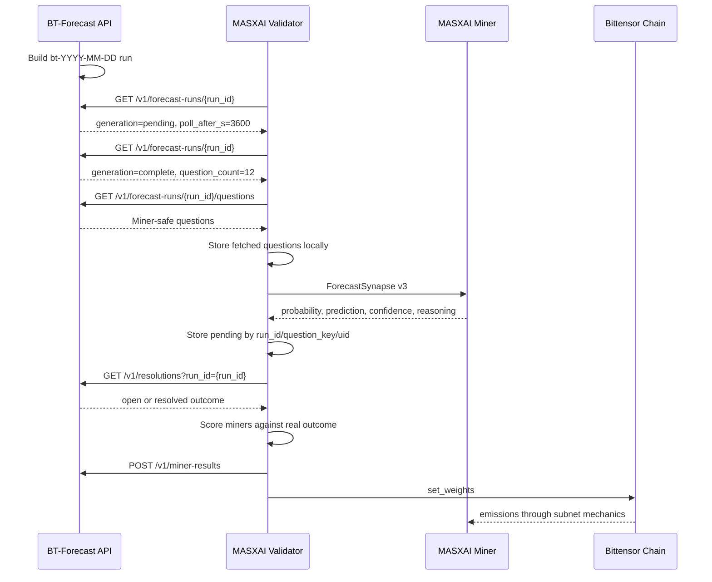

# MASXAI Subnet and BT-Forecast Flow

This document explains how the MASXAI validator, miners, Bittensor subnet, and
BT-Forecast API communicate using the real daily-run API contract.

## Actors

| Actor | Runs where | Responsibility |
| --- | --- | --- |
| BT-Forecast API | Central FastAPI service | Creates daily real-data forecast runs, serves miner-safe questions, resolves outcomes, receives miner-result feedback. |
| Validator | MASXAI subnet | Polls BT-Forecast, sends questions to miners, stores answers, fetches resolutions, scores miners, sets weights. |
| Miner | MASXAI subnet | Receives `ForecastSynapse` tasks from validators and returns probability forecasts. |
| Bittensor chain | Subnet chain | Receives validator weights and distributes emissions through normal subnet mechanics. |

Important rule:

```text
Miners never call BT-Forecast.
Only validators call BT-Forecast.
```

## Runtime Files

| File | Purpose |
| --- | --- |
| `neurons/validator.py` | Live Bittensor validator flow: poll, issue, resolve, score, feedback, weights. |
| `neurons/miner.py` | Miner axon flow: receives `ForecastSynapse`, returns forecast fields. |
| `masxai/oracle_bt.py` | BT-Forecast HTTP client and API response models. |
| `masxai/protocol.py` | `ForecastSynapse` v3 wire schema between validator and miner. |
| `masxai/scoring.py` | Brier skill, calibration, consistency, timeliness, EMA scoring. |
| `providers/bt_forecast_provider.py` | SQLite task-provider path for storing BT-Forecast questions as DB tasks. |
| `tests/test_bt_forecast_integration.py` | Contract and validator integration tests. |

## Minimal Environment

Production uses the default BT-Forecast base URL:

```text
https://masx-bt-forecast-api-production.up.railway.app
```

The only required production env key is:

```env
BT_FORECAST_BEARER_TOKEN=validator-bearer-token
```

Protected BT-Forecast endpoints use:

```http
Authorization: Bearer $BT_FORECAST_BEARER_TOKEN
```

`GET /health` is public. Set `BT_FORECAST_BASE_URL` only for staging or local
development. `BT_FORECAST_RUN_ID` and `BT_FORECAST_RUN_DATE` remain optional
test overrides; by default the validator derives today's UTC run id.

## Full Production Flow

### Step 1 - BT-Forecast Creates A Daily Run

Each morning, BT-Forecast creates a deterministic run id:

```text
bt-YYYY-MM-DD
```

Real example:

```text
bt-2026-07-22
```

### Step 2 - Validator Polls The Run Status

Validator calls:

```http
GET https://masx-bt-forecast-api-production.up.railway.app/v1/forecast-runs/bt-2026-07-22
Authorization: Bearer $BT_FORECAST_BEARER_TOKEN
```

Real response:

```json
{
  "run_id": "bt-2026-07-22",
  "status": "ready",
  "question_count": 12,
  "ready_at": "2026-07-22T09:02:04.082830+00:00",
  "template_version": "t2",
  "measurement_version": "m3",
  "generation": "complete",
  "poll_after_s": 3600
}
```

Validator behavior:

```text
if generation != "complete":
    wait poll_after_s seconds
    poll the same run again

if generation == "complete":
    fetch questions
```

The validator stores run status in local state, including `generation`,
`poll_after_s`, `template_version`, `measurement_version`, and fetched question
keys. This gives the validator an internal scheduler and avoids needing an
external cron process for the normal live neuron loop.

### Step 3 - Validator Fetches Questions

Validator calls:

```http
GET https://masx-bt-forecast-api-production.up.railway.app/v1/forecast-runs/bt-2026-07-22/questions
Authorization: Bearer $BT_FORECAST_BEARER_TOKEN
```

Real response shape:

```json
{
  "run_id": "bt-2026-07-22",
  "template_version": "t2",
  "measurement_version": "m3",
  "questions": [
    {
      "question_id": "545cb638-eaa9-4a29-bece-90c905448b41",
      "question_key": "dtao_pool|SN99|2026-07-29",
      "question": "Is SN99's thin dTAO pool (866 TAO) likely to stay below 1299 TAO by 2026-07-29 (daily snapshot)?",
      "family": "dtao_pool",
      "scope": "subnet",
      "netuid": 99,
      "horizon_days": 6,
      "generated_at": "2026-07-22T09:02:02.534442+00:00",
      "cutoff_date": "2026-07-29T00:00:00+00:00",
      "resolution_criteria": "SN99's dTAO pool (TAO reserve) < 1299 TAO on Taostats.",
      "evidence_summary": "dTAO liquidity stress: SN99 pool: 866 TAO, 125850 ALPHA.",
      "measurement": {
        "source": "daily_snapshot",
        "grade_time_utc": "06:00",
        "threshold": 1299,
        "threshold_unit": "tao",
        "operator": "below"
      }
    }
  ]
}
```

The validator stores the fetched questions locally. For the live neuron, it
stores them in `validator_state.json` as run state before issuing them to miners.
For the SQLite task-provider path, it upserts them into the `tasks` table.

### Step 4 - Validator Sends Miner-Safe Synapse

The validator converts the BT-Forecast question into a `ForecastSynapse`.

Example sent to miners:

```json
{
  "forecast_id": "validator-generated-id",
  "question_id": "545cb638-eaa9-4a29-bece-90c905448b41",
  "question_key": "dtao_pool|SN99|2026-07-29",
  "question": "Is SN99's thin dTAO pool (866 TAO) likely to stay below 1299 TAO by 2026-07-29 (daily snapshot)?",
  "event_type": "significant_bittensor_event",
  "family": "dtao_pool",
  "scope": "subnet",
  "netuid": 99,
  "horizon_days": 6,
  "issued_at": 1784700000.0,
  "resolve_at": 1785283200.0,
  "context": "dTAO liquidity stress: SN99 pool: 866 TAO, 125850 ALPHA.\nSN99's dTAO pool (TAO reserve) < 1299 TAO on Taostats.\nMeasurement: {\"grade_time_utc\": \"06:00\", \"operator\": \"below\", \"source\": \"daily_snapshot\", \"threshold\": 1299, \"threshold_unit\": \"tao\"}\nBT-Forecast run: bt-2026-07-22",
  "version": 3
}
```

Miner-safe means the synapse does not include:

```text
engine_probability
anchor_probability
chain_probability
llm_probability
predetermined_at_creation
private credentials
```

### Step 5 - Miner Returns Forecast

Miner responds over Bittensor, not HTTP:

```json
{
  "forecast_id": "validator-generated-id",
  "probability": 0.82,
  "prediction": true,
  "confidence": 0.82,
  "reasoning": "SN99 pool is far below the threshold, so it is likely to remain below 1299 TAO.",
  "model": "miner-model",
  "features": {},
  "timestamp": "2026-07-22T09:15:11+00:00"
}
```

`probability` is the primary scoring field. `prediction` and `confidence` are
kept for compatibility and calibration.

### Step 6 - Validator Stores Pending Forecast

The live validator stores one active pending forecast per:

```text
(run_id, question_key, miner_uid)
```

Example:

```json
{
  "source": "bt_forecast",
  "uid": 1,
  "hotkey": "miner-hotkey-1",
  "run_id": "bt-2026-07-22",
  "question_id": "545cb638-eaa9-4a29-bece-90c905448b41",
  "question_key": "dtao_pool|SN99|2026-07-29",
  "family": "dtao_pool",
  "scope": "subnet",
  "netuid": 99,
  "horizon_days": 6,
  "probability": 0.82,
  "prediction": true,
  "confidence": 0.82,
  "reasoning": "SN99 pool is far below the threshold, so it is likely to remain below 1299 TAO.",
  "model": "miner-model",
  "issued_at": 1784700000.0,
  "submitted_at": 1784700911.0,
  "resolve_at": 1785283200.0,
  "cutoff_date": "2026-07-29T00:00:00+00:00",
  "measurement": {
    "source": "daily_snapshot",
    "grade_time_utc": "06:00",
    "threshold": 1299,
    "threshold_unit": "tao",
    "operator": "below"
  }
}
```

### Step 7 - Validator Waits Until Cutoff

For the SN99 example, the cutoff is:

```text
2026-07-29T00:00:00+00:00
```

Until the cutoff and daily snapshot are available, the validator leaves the
forecast pending.

### Step 8 - Validator Fetches Resolutions

Validator calls:

```http
GET https://masx-bt-forecast-api-production.up.railway.app/v1/resolutions?run_id=bt-2026-07-22
Authorization: Bearer $BT_FORECAST_BEARER_TOKEN
```

Open response example from the real API:

```json
{
  "resolutions": [
    {
      "question_key": "dtao_pool|SN99|2026-07-29",
      "family": "dtao_pool",
      "scope": "subnet",
      "netuid": 99,
      "horizon_days": 6,
      "status": "open",
      "outcome": null,
      "cutoff_date": "2026-07-29T00:00:00+00:00",
      "resolved_at": null,
      "measurement": {
        "source": "daily_snapshot",
        "grade_time_utc": "06:00",
        "threshold": 1299,
        "threshold_unit": "tao",
        "operator": "below"
      },
      "measurement_value": null,
      "observed_at": null,
      "explanation": null,
      "engine_brier": null,
      "deferral_reason": null
    }
  ]
}
```

If status is `open`, the validator waits and tries later.

Resolved example:

```json
{
  "question_key": "dtao_pool|SN99|2026-07-29",
  "family": "dtao_pool",
  "scope": "subnet",
  "netuid": 99,
  "horizon_days": 6,
  "status": "resolved_true",
  "outcome": true,
  "cutoff_date": "2026-07-29T00:00:00+00:00",
  "resolved_at": "2026-07-29T06:04:10+00:00",
  "measurement_value": 1100
}
```

For this example, `1100 < 1299`, so the outcome is `true`.

Terminal unscored statuses are dropped:

```text
expired
annulled
ambiguous
rejected
```

### Step 9 - Validator Scores Miners

The validator scores every pending miner answer against the real outcome.

Example:

```text
miner probability = 0.82
outcome = true
Brier = (0.82 - 1.0)^2 = 0.0324
```

Another miner:

```text
miner probability = 0.25
outcome = true
Brier = (0.25 - 1.0)^2 = 0.5625
```

Lower Brier is better. The final structured score combines:

```text
50% Brier skill vs baseline
20% confidence calibration
20% historical consistency
10% timeliness
```

The validator then updates the miner's EMA score:

```text
self.scores[uid] = EMA(previous_score, reward)
```

### Step 10 - Validator Sets Subnet Weights

Weights follow normal Bittensor mechanics:

```text
miner forecasts
-> BT-Forecast resolution
-> validator scores
-> normalized weights
-> set_weights
-> Bittensor emissions
```

Miners are not paid by BT-Forecast directly. They receive emissions through the
subnet weight and consensus loop.

### Step 11 - Validator Posts Miner Results Back To BT-Forecast

Validator sends accurate resolved miner forecasts back for calibration:

```http
POST https://masx-bt-forecast-api-production.up.railway.app/v1/miner-results
Authorization: Bearer $BT_FORECAST_BEARER_TOKEN
Content-Type: application/json
```

Request body:

```json
{
  "run_id": "bt-2026-07-22",
  "question_key": "dtao_pool|SN99|2026-07-29",
  "family": "dtao_pool",
  "scope": "subnet",
  "netuid": 99,
  "horizon_days": 6,
  "outcome": true,
  "measurement_value": 1100,
  "resolved_at": "2026-07-29T06:04:10+00:00",
  "engine_probability": null,
  "results": [
    {
      "uid": 1,
      "hotkey": "miner-hotkey-1",
      "probability": 0.82,
      "prediction": true,
      "confidence": 0.82,
      "reasoning": "SN99 pool is far below the threshold.",
      "model": "miner-model",
      "features": {},
      "issued_at": 1784700000.0,
      "submitted_at": 1784700911.0,
      "brier": 0.0324,
      "dist_to_outcome": 0.18,
      "dist_to_engine": null
    }
  ]
}
```

`engine_probability` and `dist_to_engine` are `null` unless the validator fetched
lineage fields and BT-Forecast provided an engine probability. This feedback is
for BT-Forecast calibration. It is not the emission gate.

## Communication Map

```text
BT-Forecast API
  creates daily real-data run and questions
  resolves outcomes later
  receives validator feedback

Validator
  polls /v1/forecast-runs/{run_id}
  waits poll_after_s until generation is complete
  fetches /v1/forecast-runs/{run_id}/questions
  sends ForecastSynapse tasks to miners
  stores pending miner forecasts
  fetches /v1/resolutions?run_id={run_id}
  scores miners
  posts /v1/miner-results
  sets Bittensor weights

Miner
  receives only the subnet question and context
  returns probability, prediction, confidence, reasoning
  never receives BT-Forecast credentials or private lineage data

Bittensor chain
  receives validator weights
  distributes miner emissions through normal subnet mechanics
```

## Sequence Diagram



## Privacy Rules

Safe to send to miners:

```text
question
question_key
family
scope
netuid
horizon_days
cutoff/resolve time
evidence_summary
resolution_criteria
measurement
```

Do not send to miners:

```text
engine_probability
anchor_probability
chain_probability
llm_probability
predetermined_at_creation lineage data
private service credentials
internal calibration parameters
```

## Local Mock And Tests

Local no-chain mock:

```bash
python3 scripts/mock_run.py
```

BT-Forecast integration tests:

```bash
python3 -m pytest tests/test_bt_forecast_integration.py -q
```

The integration tests verify:

```text
validator waits for generation=complete
questions are stored before miner issue
miner synapses do not include engine_probability
resolutions parse the real API shape
miner-results payload matches the POST schema
```

## Summary

```text
BT-Forecast creates the daily real-data run.
Validator polls the run until generation is complete.
Validator fetches and stores miner-safe questions.
Validator sends questions to miners over Bittensor.
Miners return independent probability forecasts.
Validator stores forecasts as pending.
Validator fetches real outcomes after cutoff.
Validator scores miners against real outcomes.
Validator posts useful miner results back to BT-Forecast.
Validator sets Bittensor weights from miner scores.
```
