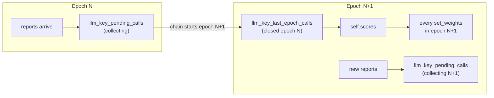

# Per-epoch emission

Emission in each chain epoch now pays for the LLM-key usage reported in the
**previous, completed epoch**, and nothing older. Before this change, reports
fed a running EMA, so a miner that was used once kept earning for about two
days, until the staleness decay kicked in.

Full scoring reference: [scoring.md](scoring.md).

## What changed

| | Before | Now |
|---|---|---|
| Score | EMA across all past windows | Reward of the last completed epoch only |
| Window | Flushed at ≥5 calls or after 7 days | One chain epoch (tempo 360 blocks, ~72 min) |
| Minimum calls to earn | 5 | 1 (any good report earns) |
| Quiet miner | Kept earning for 48 h, then EMA decay | Earns 0 in the next epoch |
| Bad key | Its traffic share cut from the EMA | Its rows removed; the hotkey is re-scored on its other keys |

Unchanged: the reward formula and hard floors in
`masxai/scoring.py::llm_key_efficiency_score()`, the per-key junk gate
(5 calls of evidence), per-call tier blending, the evidence gate
(`_has_llm_key_evidence()`), and the 95% burn.

Removed settings: `MASXAI_LLM_KEY_EMA_ALPHA`, `MASXAI_LLM_KEY_EMA_CONFIDENCE_FLOOR`,
`MASXAI_LLM_KEY_PENDING_WINDOW_MAX_SECONDS`, `MASXAI_LLM_KEY_STALENESS_TIMEOUT_SECONDS`.
They are ignored if still set.

## How it works



1. Every report poll and every `set_weights()` reads the current epoch start
   from the chain: `block − blocks_since_last_step(netuid, block)`, both read
   at the same block.
2. If the chain has moved on (`_roll_epoch_if_needed()`), the collecting
   window closes into `llm_key_last_epoch_calls`, a new empty window starts,
   and `self.scores` is recomputed from the closed epoch (`_score_last_epoch()`).
3. Every weight set during the epoch submits those scores. Kills (inactive
   row, fatal error, roster `DEAD`/`REVOKED`, per-key floor) remove the key's
   rows from both windows and apply at the next recompute.

**Why the previous epoch and not the running one.** The validator sets
weights every ~100 blocks, but only the weights on chain when an epoch ends
count. Scoring the running epoch would miss the calls made after the last
weight set before each boundary, and an early weight set could burn
everything.

## Edge cases

| Case | Behaviour |
|---|---|
| Validator down across more than one epoch | Stale window discarded, not paid late |
| State from before this change (no epoch on record) | Old accumulator and EMA scores discarded |
| Epoch shorter than half a tempo (owner-triggered) | Folded into the next epoch; the real previous epoch keeps being paid |
| Chain unreadable (RPC error) | Nothing changes until the next successful read |
| Restart within an epoch | Both windows and the epoch are persisted, nothing lost |
| Report received just after a boundary | Counts toward the epoch it arrives in (≤10 min poll lag), paid one epoch later |

## Deploying

- **Expect up to two epochs (~2.5 h) of 100% burn after the upgrade.** Old
  scores are discarded; the first epoch is collected, then paid in the next.
- **Low traffic means mostly burn.** If only the daily health-check pings
  report usage, most epochs contain no reports.
- **Testnet 501 needs `MASXAI_BURN_UID`.** `BURN_UID` defaults to 25, which
  doesn't exist on testnet 501 (uids 0–14), and the override isn't on `main`
  yet. Mainnet 104 is unaffected.

## Checking it

Unit tests (`tests/test_llm_key_pipeline.py`, "per-epoch emission" section):

```bash
python -m pytest tests/ -q
```

Against a live chain, read-only (never writes state, never sets weights):

```bash
# chain epoch reads only
python scripts/check_per_epoch_emission.py --network finney --netuid 104

# plus: what this validator's state would pay right now
python scripts/check_per_epoch_emission.py --network test --netuid 501 \
    --state-file validator_state.json --burn-uid 0
```

It exits non-zero on failure. Sample output on testnet 501, run against the
live validator's pre-upgrade state:

```text
== Part 1: epoch reads on netuid 501 ==
  epoch start block   8034249  (5 reads, stable=True)
  epoch length        361 blocks (tempo + 1)
  next epoch starts   8034609 (gap 360 blocks): paid as the previous epoch
  two-epoch gap       720 blocks: discarded
== Part 2: what validator_state.json would pay now ==
  epoch on record     None  (chain now: 8034249)
  -> state predates per-epoch scoring: old scores/accumulator discarded
  ...
  final weights (burn uid 0):
    uid   0: 1.0000
PASS
```
