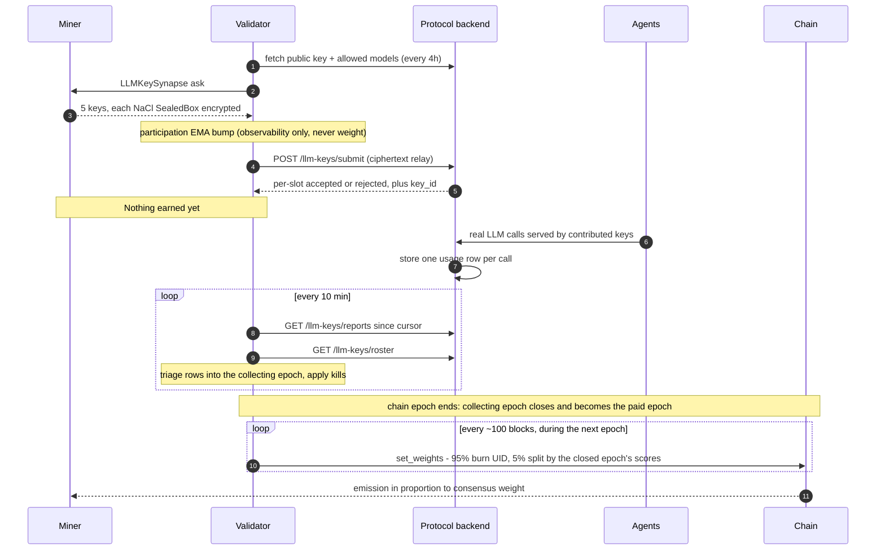
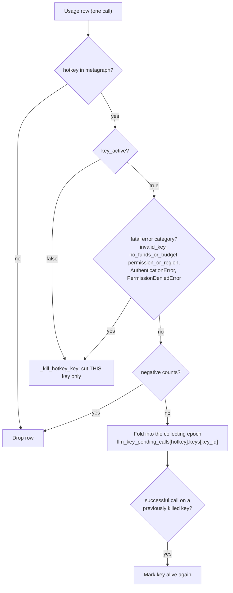
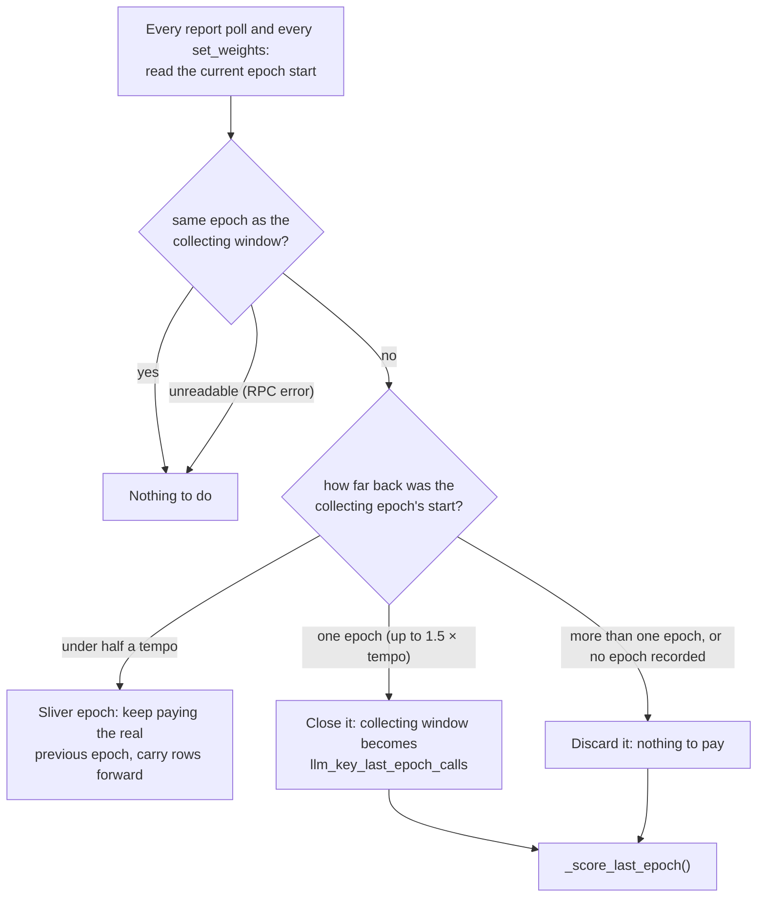
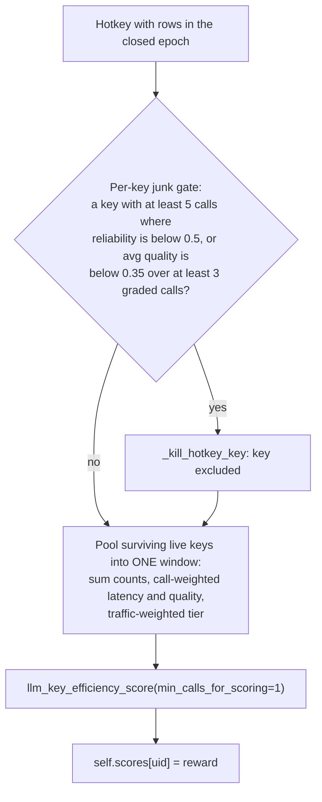
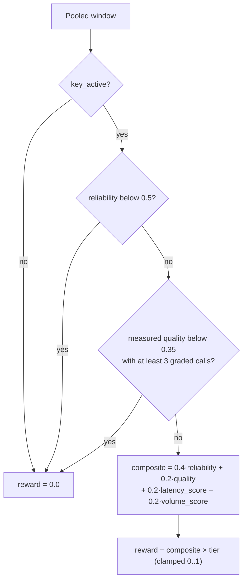
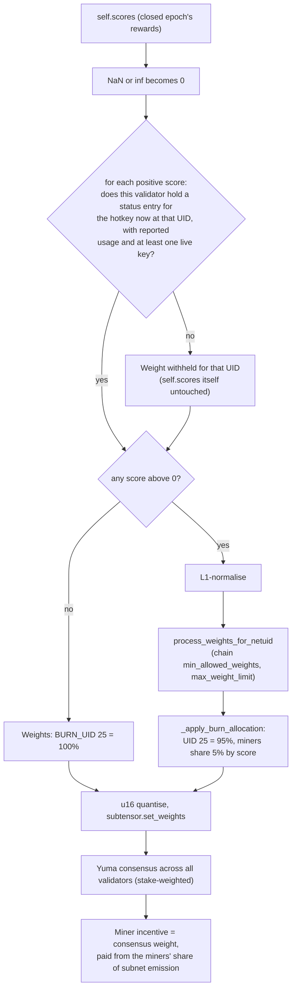

# Scoring and Emission

How a MASXAI miner is scored and how that score becomes emission. Everything
here describes the code as it stands; constants are the defaults in
[masxai/constants.py](../masxai/constants.py) (most are overridable by env var).

## TL;DR

- A miner earns **only** from real, protocol-reported usage of the 5 LLM keys it
  contributed. Registering, answering the ask, or having keys accepted earns
  nothing.
- Scoring runs **per chain epoch** (tempo 360 blocks, about 72 minutes). The
  emission in each epoch pays for the reports of the **previous, completed**
  epoch. Nothing carries over: a miner with no good report in the last epoch
  earns nothing in this one.
- The protocol reports **one row per call**. The validator collects the current
  epoch's rows per hotkey (and per key). When the epoch ends, each hotkey's
  rows are scored as one window. There is no minimum call count: a single good
  report earns.
- A window's reward is
  `(0.4·reliability + 0.2·quality + 0.2·latency + 0.2·volume) × model tier`,
  with two hard floors (reliability below 0.5, or measured quality below 0.35)
  that force the reward to 0.
- `self.scores[uid]` is simply that reward, with no averaging across epochs.
  Confirmed-bad keys are cut immediately, and only their rows go.
- On-chain weights: **95% to the burn UID (25)**. The other **5% is split between
  miners in proportion to `self.scores`**. If nobody has a positive score, 100%
  burns.

---

## 1. End-to-end flow

The two validator rounds live in
[neurons/validator.py](../neurons/validator.py):
`llm_key_submission_round()` (ask + relay) and `llm_key_report_poll_round()`
(collect rows, apply kills, recompute scores). Weights are set by the
template's epoch loop through `Validator.set_weights()`, which first closes the
epoch if the chain has moved on and then calls
`BaseValidatorNeuron.set_weights()` in
[template/base/validator.py](../template/base/validator.py).

---

## 2. Stage A — triaging each usage row

Every report row carries `hotkey, key_id, provider/model, success_count,
failure_count, avg_latency_ms, avg_quality_score, error_categories, key_active`
(`LLMKeyUsageReport` in [masxai/llm_key_client.py](../masxai/llm_key_client.py)).

Each key has its own sub-accumulator: success and failure counts, a latency sum
and a quality sum (each weighted by call count), and the key's **tier** (taken
from the row's own provider/model). Latency and quality are sanitized on their
own: a NaN, inf or out-of-range reading counts as "not reported" and doesn't
invalidate the rest of the row.

A row counts toward the epoch in which the validator **receives** it. Rows are
polled every 10 minutes, so a call made just before an epoch boundary can land
in the next epoch. It is then paid one epoch later, not lost.

---

## 3. Stage B — epochs

The epoch start is read from the chain (`block − blocks_since_last_step`, both
values read at the same block) rather than computed from tempo. The chain's own
schedule isn't a fixed formula (a subnet owner can trigger an epoch early), and
the textbook `(block + netuid + 1) % (tempo + 1)` formula disagreed with the
chain on both testnet 501 and mainnet 104. Only the current block is ever read,
so this works on pruned (non-archive) nodes.

- **More than one epoch** means the validator was down across an epoch
  boundary. What it collected belongs to an epoch that has already been paid by
  someone else's weights, so it is discarded rather than paid late.
- **No epoch recorded** means the state was written before per-epoch scoring.
  The old accumulator and the old EMA scores are discarded the same way. After
  an upgrade, expect up to two epochs of 100% burn: the running epoch, then the
  first full epoch being collected.

---

## 4. Stage C — the efficiency reward

`_score_last_epoch()` scores each hotkey in the closed epoch:

- **Blended tier:** `tier = Σ(tier_k × calls_k) / total_calls`. Every call is
  worth its own model's tier, so cheap keys stacked next to one top-tier key
  can't borrow its multiplier.
- **No call-volume floor on the pooled window.** `LLM_KEY_MIN_CALLS_FOR_SCORING`
  (5) is only the evidence needed to kill one key on its own sub-window.
- Every UID with no rows in the closed epoch scores 0.

`llm_key_efficiency_score()` in [masxai/scoring.py](../masxai/scoring.py) is the
only place the formula lives.

| Axis | Weight | Formula | When missing |
|---|---|---|---|
| Reliability | 0.4 | `success / (success + failure)` | — |
| Quality | 0.2 | call-weighted avg `quality_score` (self-graded by the calling agent) | neutral **0.5** |
| Latency | 0.2 | `clamp(1 − avg_latency_s / 5.0, 0, 1)` | neutral **0.5** |
| Volume | 0.2 | `min(1, success_count / 50)`, successes in the epoch only | — |

**Model tier multiplier** (`LLM_KEY_MODEL_TIER_WEIGHTS`):

| provider/model | tier |
|---|---|
| openai/gpt-4o | 1.0 |
| anthropic/claude-3-5-sonnet-20241022 | 1.0 |
| openai/gpt-4o-mini | 0.6 |
| anthropic/claude-3-5-haiku-20241022 | 0.6 |
| deepseek/deepseek-chat | 0.5 |
| any other allowed model | 0.5 (default) |

**Worked examples** (computed with the real function):

| Epoch window | Reward |
|---|---|
| 1 ok, 1.2 s, ungraded, gpt-4o | **0.656** (0.4 + 0.1 + 0.152 + 0.004) |
| 5 ok / 0 fail, 1.2 s, ungraded, gpt-4o | **0.672** (0.4 + 0.1 + 0.152 + 0.02) |
| 50 ok, 1.2 s, quality 0.8, gpt-4o | **0.912** |
| same, gpt-4o-mini (tier 0.6) | **0.547** |
| 3 ok / 3 fail (reliability exactly 0.5) | **0.464**, floor is strict `<` |
| 2 ok / 3 fail | **0.0**, reliability floor |
| 10 ok, quality 0.2 over 3 graded | **0.0**, quality floor |
| perfect: 50 ok, 0 s, quality 1.0, tier 1.0 | **1.0** |

---

## 5. Stage D — what changes `self.scores[uid]`

`self.scores` always holds the closed epoch's rewards. It is recomputed from
`llm_key_last_epoch_calls` at the end of every report poll and before every
weight set, so anything that removes rows from that window takes effect at the
next recompute.

| Event | Trigger | Effect on `self.scores[uid]` | Code |
|---|---|---|---|
| Epoch closes | chain moves to the next epoch | = the closed epoch's reward (0 if no rows) | `_roll_epoch_if_needed` → `_score_last_epoch` |
| One key confirmed bad | `key_active=false` row, fatal error category, roster `DEAD`/`REVOKED`, per-key floor | that key's rows leave both windows; the hotkey is re-scored on its other keys | `_kill_hotkey_key` |
| Every key dead | any of the above | **= 0** (no rows left) | `_kill_hotkey_key` |
| Key revived | successful call on a killed key | key marked alive; earns again from its new rows | `_fold_report_into_pending` |
| UID changes hands | metagraph resync sees a new hotkey | **= 0**; scoring maps hotkeys to UIDs through the current metagraph | `resync_metagraph`, `_score_last_epoch` |

---

## 6. Stage E — from scores to emission

- **Only scores this pipeline produced are payable.** A positive score is paid
  only if the validator holds an `llm_key_hotkey_status` entry for the hotkey
  *currently* at that UID, with `last_report_at` set and at least one key not
  locally killed (`_has_llm_key_evidence()`).
- **Participation** (`participation_scores`) is tracked but never read here.
- Every weight set during an epoch submits the same closed epoch's scores,
  apart from keys killed in the meantime.
- If UID 25 isn't in the metagraph, `_apply_burn_allocation` raises and that
  epoch's `set_weights` is skipped (logged as an error).
- The steps after `set_weights` are standard Bittensor, not code in this repo.
  Under dynamic TAO, miners collectively get 41% of the subnet's emission,
  divided by incentive. Any validator weight above the stake-weighted consensus
  is clipped.

**Example.** In the last epoch, miner A's window scored 0.60, miner B's 0.30,
and miner C had accepted keys but no reported usage (0.0). The weights
submitted throughout this epoch are:

| UID | Weight |
|---|---|
| 25 (burn) | 95.00% |
| A | 3.33% (`0.60 / 0.90 × 5%`) |
| B | 1.67% (`0.30 / 0.90 × 5%`) |
| C | 0% |

---

## 7. Cadences

| What | Default | Knob |
|---|---|---|
| Chain epoch (scoring window) | tempo 360 blocks (~72 min) | chain hyperparameter |
| Ask miners + relay keys | 4 h | `LLM_KEY_SUBMISSION_INTERVAL_SECONDS` |
| Report + roster poll | 10 min | `LLM_KEY_REPORT_POLL_INTERVAL_SECONDS` |
| Set weights | ~every 100 blocks (~20 min) | `--neuron.epoch_length` |
| Evidence to kill one key on its own window | 5 calls | `LLM_KEY_MIN_CALLS_FOR_SCORING` |
| Forget a deregistered hotkey | 24 h grace | `LLM_KEY_HOTKEY_STATUS_EVICTION_GRACE_SECONDS` |

---

## 8. Things to know before changing the scoring

Each point below follows from the current code and defaults.

1. **Pay lags work by one epoch.** Usage in epoch N is paid throughout epoch
   N+1. This is deliberate: weights are set every ~100 blocks, but only the
   weights on chain when an epoch ends count. Scoring the still-running epoch
   would miss the calls made after the last weight set before each boundary.
2. **Low traffic means mostly burn.** If the backend's only report source is a
   daily health-check ping per key, most epochs contain no reports at all, so
   most epochs burn 100% and a miner is paid only in the epoch after one of its
   pings lands.
3. **The volume target roughly matches a fully used epoch.** At the backend's
   200 calls/day per key, a fully used 5-key hotkey serves about 50 calls per
   72-minute epoch, which is the volume target (50).
4. **A validator restart across an epoch boundary costs that epoch.** The
   collecting window is persisted, but if the validator is down when an epoch
   ends and comes back after the next one has started, the window is
   discarded. A restart within an epoch loses nothing.
5. **The tier table is short.** Allowed models come from the backend at runtime.
   Any model missing from `LLM_KEY_MODEL_TIER_WEIGHTS` (for example a newer
   flagship model) scores at the 0.5 default until the table is updated.
6. **Template weight processing depends on chain hyperparameters.**
   `process_weights_for_netuid` returns a **uniform** vector across all UIDs
   when `metagraph.n < min_allowed_weights`, which would give every registered
   UID an equal cut of the 5%. `normalize_max_weight` flattens earners to equal
   weights when `earners × max_weight_limit ≤ 1`. Neither happens with default
   hyperparameters, but check both values for the target netuid.

---

## 9. Code map

| Concern | Location |
|---|---|
| Reward formula, floors, sanitizers, fatal categories | [masxai/scoring.py](../masxai/scoring.py) |
| All weights, floors, cadences, tier table, burn | [masxai/constants.py](../masxai/constants.py) |
| Row triage, epochs, scoring, kills | [neurons/validator.py](../neurons/validator.py) — `llm_key_report_poll_round`, `_fold_report_into_pending`, `_roll_epoch_if_needed`, `_score_last_epoch`, `_pooled_window_reward`, `_kill_hotkey_key`, `_poll_llm_key_roster` |
| Scores → chain weights, burn split | [template/base/validator.py](../template/base/validator.py) — `set_weights`, `_apply_burn_allocation` |
| Chain-limit processing | [template/base/utils/weight_utils.py](../template/base/utils/weight_utils.py) |
| Tests | [tests/test_scoring.py](../tests/test_scoring.py), [tests/test_llm_key_pipeline.py](../tests/test_llm_key_pipeline.py), [tests/test_burn_weights.py](../tests/test_burn_weights.py) |
