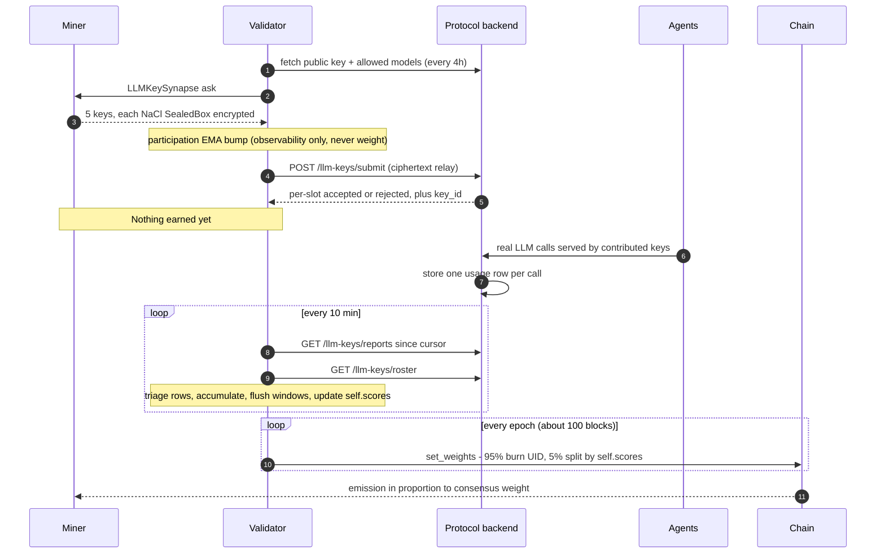
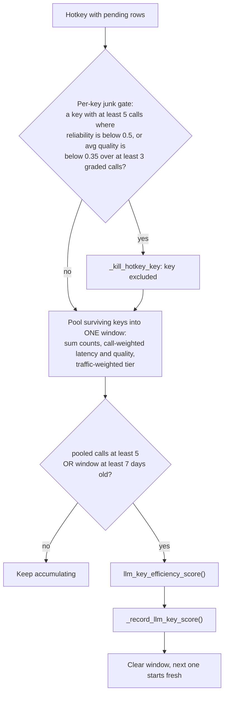
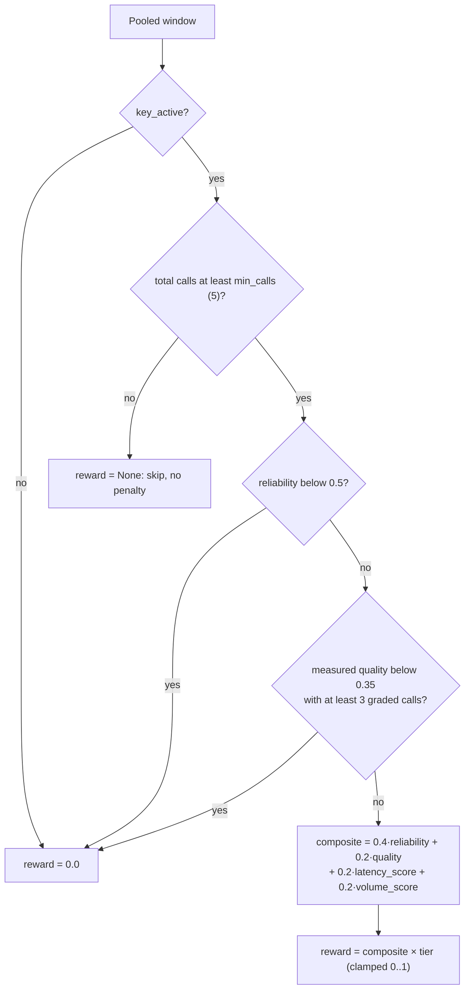
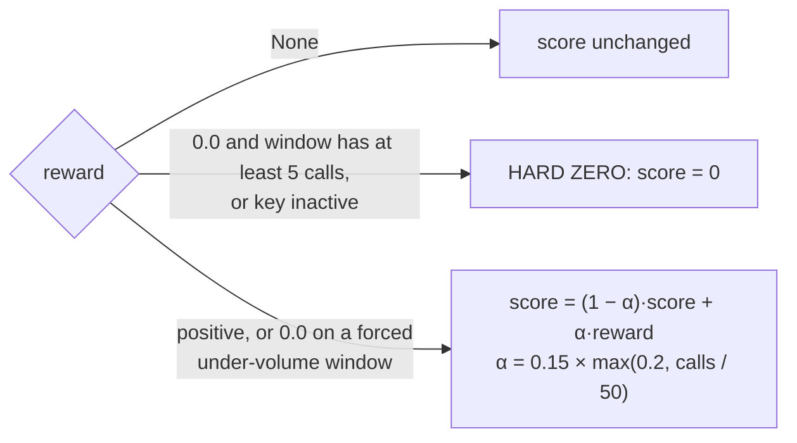
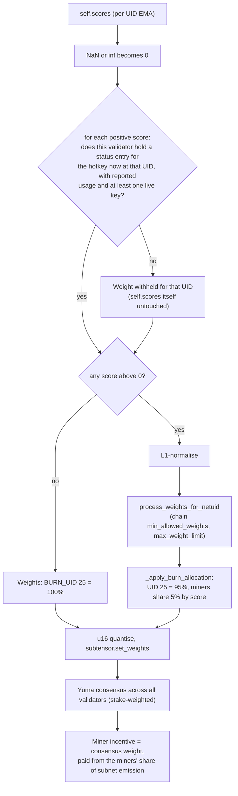

# Scoring and Emission

How a MASXAI miner is scored and how that score becomes emission. Everything
here describes the code as it stands; constants are the defaults in
[masxai/constants.py](../masxai/constants.py) (most are overridable by env var).

## TL;DR

- A miner earns **only** from real, protocol-reported usage of the 5 LLM keys it
  contributed. Registering, answering the ask, or having keys accepted earns
  nothing — and a score is paid only while the validator can still point at the
  reports behind it.
- The protocol reports **one row per call**. The validator accumulates rows per
  hotkey (and per key) into a window, and scores the window once it holds at
  least **5 calls** (or is 7 days old).
- A window's reward is
  `(0.4·reliability + 0.2·quality + 0.2·latency + 0.2·volume) × model tier`,
  with two hard floors (reliability below 0.5, or measured quality below 0.35)
  that force the reward to 0.
- The reward feeds an EMA, `self.scores[uid]`. Confirmed-bad keys are cut
  immediately, and only their share of the score goes. The whole score is
  zeroed when the last live key dies or the whole fleet fails.
- On-chain weights: **95% to the burn UID (25)**. The other **5% is split between
  miners in proportion to `self.scores`**. If nobody has a positive score, 100%
  burns.

---

## 1. End-to-end flow

The two validator rounds live in
[neurons/validator.py](../neurons/validator.py):
`llm_key_submission_round()` (ask + relay) and `llm_key_report_poll_round()`
(everything that touches the score). Weights are set by the template's epoch
loop through `Validator.set_weights()`, which calls
`BaseValidatorNeuron.set_weights()` in
[template/base/validator.py](../template/base/validator.py).

---

## 2. Stage A — triaging each usage row

Every report row carries `hotkey, key_id, provider/model, success_count,
failure_count, avg_latency_ms, avg_quality_score, error_categories, key_active`
(`LLMKeyUsageReport` in [masxai/llm_key_client.py](../masxai/llm_key_client.py)).

Each key has its own sub-accumulator: success and failure counts, a latency sum
and a quality sum (each weighted by call count), and the key's **tier** (taken
from the row's own provider/model). Latency and quality are sanitized on their
own: a NaN, inf or out-of-range reading counts as "not reported" and doesn't
invalidate the rest of the row.

---

## 3. Stage B — flushing a window

Runs every poll for **every** hotkey with pending rows, not only hotkeys that got
new rows in this poll. Otherwise a quiet hotkey's window would never age out.

- **Blended tier:** `tier = Σ(tier_k × calls_k) / total_calls`. Every call is
  worth its own model's tier, so cheap keys stacked next to one top-tier key
  can't borrow its multiplier.
- **Forced flush:** a window that reaches 7 days old with fewer than 5 calls is
  scored anyway (`min_calls_for_scoring=1`). The EMA step is damped for it (see
  §5).

---

## 4. Stage C — the efficiency reward

`llm_key_efficiency_score()` in [masxai/scoring.py](../masxai/scoring.py) is the
only place this formula lives.

| Axis | Weight | Formula | When missing |
|---|---|---|---|
| Reliability | 0.4 | `success / (success + failure)` | — |
| Quality | 0.2 | call-weighted avg `quality_score` (self-graded by the calling agent) | neutral **0.5** |
| Latency | 0.2 | `clamp(1 − avg_latency_s / 5.0, 0, 1)` | neutral **0.5** |
| Volume | 0.2 | `min(1, success_count / 50)`, successes only | — |

**Model tier multiplier** (`LLM_KEY_MODEL_TIER_WEIGHTS`):

| provider/model | tier |
|---|---|
| openai/gpt-4o | 1.0 |
| anthropic/claude-3-5-sonnet-20241022 | 1.0 |
| openai/gpt-4o-mini | 0.6 |
| anthropic/claude-3-5-haiku-20241022 | 0.6 |
| deepseek/deepseek-chat | 0.5 |
| any other allowed model | 0.5 (default) |

**Worked examples** (computed with the real function):

| Window | Reward |
|---|---|
| 5 ok / 0 fail, 1.2 s, ungraded, gpt-4o | **0.672** (0.4 + 0.1 + 0.152 + 0.02) |
| 50 ok, 1.2 s, quality 0.8, gpt-4o | **0.912** |
| same, gpt-4o-mini (tier 0.6) | **0.547** |
| 3 ok / 3 fail (reliability exactly 0.5) | **0.464**, floor is strict `<` |
| 2 ok / 3 fail | **0.0**, reliability floor |
| 10 ok, quality 0.2 over 3 graded | **0.0**, quality floor |
| 4 calls total | **None**, below volume floor |
| perfect: 50 ok, 0 s, quality 1.0, tier 1.0 | **1.0** |

---

## 5. Stage D — how the reward moves `self.scores[uid]`

`_record_llm_key_score()` applies the reward:

The EMA step is scaled by confidence. A 5-call window moves the score with
`α = 0.03`, and a 50-call window with the full `α = 0.15`.

Other events also change the score, outside the window path:

| Event | Trigger | Effect on `self.scores[uid]` | Code |
|---|---|---|---|
| Window scored | pooled window flushed | EMA toward reward (above) | `_record_llm_key_score` |
| Whole fleet fails | full window trips a floor | **= 0** | `_zero_llm_key_score` |
| One key confirmed bad | `key_active=false` row, fatal error category, roster `DEAD`/`REVOKED`, per-key floor | **× (1 − key's traffic share)**, idempotent | `_kill_hotkey_key` |
| Last live key killed | any of the above | **= 0** | `_kill_hotkey_key` → `_zero_llm_key_score` |
| Reports went stale | positive score, no report for 48 h | one EMA step toward 0 (α 0.15) **per poll** | `_decay_stale_llm_key_scores` |
| Key revived | successful call on a killed key | key marked alive; score is **not** restored, it re-earns through the EMA | `_fold_report_into_pending` |
| UID changes hands | metagraph resync sees a new hotkey | **= 0** | `resync_metagraph` |

**Kill share:** a key's share is its calls divided by the hotkey's calls, counted
over the current pending window plus the last flushed window. With no traffic
evidence the split is assumed equal: `1 / (live keys + 1)`.

---

## 6. Stage E — from scores to emission

- **Only scores this pipeline produced are payable.** A positive score is paid
  only if the validator holds an `llm_key_hotkey_status` entry for the hotkey
  *currently* at that UID, with `last_report_at` set and at least one key not
  locally killed (`_has_llm_key_evidence()`). Anything else — a state file
  inherited from the pre-LLM-key forecasting subnet, which persisted its
  accuracy EMA under the same `"scores"` key, or a UID that changed hands
  while the validator was down — is dropped at load (`_drop_unbacked_scores()`)
  and withheld from the submitted array. It is not a recency check: staleness
  is handled by the decay path instead.
- **Participation** (`participation_scores`) is tracked but never read here.
- `set_weights()` swaps in a NaN-safe copy of `self.scores` for the submission
  and then restores the original. The persisted EMA is never overwritten.
- If UID 25 isn't in the metagraph, `_apply_burn_allocation` raises and that
  epoch's `set_weights` is skipped (logged as an error).
- The steps after `set_weights` are standard Bittensor, not code in this repo.
  Under dynamic TAO, miners collectively get 41% of the subnet's emission,
  divided by incentive. Any validator weight above the stake-weighted consensus
  is clipped.

**Example.** Miner A has score 0.60, miner B 0.30, and miner C has accepted keys
but no reported usage (0.0). The submitted weights are:

| UID | Weight |
|---|---|
| 25 (burn) | 95.00% |
| A | 3.33% (`0.60 / 0.90 × 5%`) |
| B | 1.67% (`0.30 / 0.90 × 5%`) |
| C | 0% |

---

## 7. Cadences

| What | Default | Knob |
|---|---|---|
| Ask miners + relay keys | 4 h | `LLM_KEY_SUBMISSION_INTERVAL_SECONDS` |
| Report + roster poll (all score updates) | 10 min | `LLM_KEY_REPORT_POLL_INTERVAL_SECONDS` |
| Set weights | ~every 100 blocks (~20 min) | `--neuron.epoch_length` |
| Min calls to score a window | 5 | `LLM_KEY_MIN_CALLS_FOR_SCORING` |
| Force-flush a quiet window | 7 days | `LLM_KEY_PENDING_WINDOW_MAX_SECONDS` |
| Stale decay starts | 48 h with no report | `LLM_KEY_STALENESS_TIMEOUT_SECONDS` |
| Forget a deregistered hotkey | 24 h grace | `LLM_KEY_HOTKEY_STATUS_EVICTION_GRACE_SECONDS` |

---

## 8. Things to know before changing the scoring

Each point below follows from the current code and defaults.

1. **The volume axis almost never gets near 1.0.** A window flushes at the first
   poll where it holds at least 5 calls, so `volume = successes / 50` measures
   the traffic that arrived since the last 10-minute poll, not sustained
   capacity. At the backend's 200 calls/day per key, a fully used 5-key hotkey
   delivers about 7 calls per poll, so volume is about 0.14 (a 0.028 score
   contribution). With only daily health-check pings (5 calls/day), volume is
   0.1. The volume target (50) doesn't match the window size.
2. **Scores converge slowly at low traffic.** The confidence scaling uses the
   same `calls / 50`, so a typical 5-call window uses `α = 0.03`:

   | Calls per window | Effective α | Windows to reach 50% of reward | to 90% |
   |---|---|---|---|
   | 5 | 0.03 | 23 | 76 |
   | 20 | 0.06 | 11 | 37 |
   | 50 | 0.15 | 4 | 14 |

   With one window a day (health pings only), a new miner takes about 3 weeks
   to reach half its steady-state score. With steady traffic (a window every
   poll), it takes about 4 hours.
3. **"Gradual" stale decay is fast once it starts.** After the 48 h timeout it
   applies α 0.15 on every 10-minute poll: about 38% of the score is left after
   1 hour and about 2% after 4 hours.
4. **The tier table is short.** Allowed models come from the backend at runtime.
   Any model missing from `LLM_KEY_MODEL_TIER_WEIGHTS` (for example a newer
   flagship model) scores at the 0.5 default until the table is updated.
5. **Template weight processing depends on chain hyperparameters.**
   `process_weights_for_netuid` returns a **uniform** vector across all UIDs
   when `metagraph.n < min_allowed_weights`, which would give every registered
   UID an equal cut of the 5%. `normalize_max_weight` flattens earners to equal
   weights when `earners × max_weight_limit ≤ 1`. Neither happens with default
   hyperparameters, but check both values for the target netuid.
6. **The stored UID for a hotkey isn't re-checked inside the pipeline.** Roster
   kills and aged-out flushes use `llm_key_hotkey_status[hotkey]["uid"]` without
   confirming that `metagraph.hotkeys[uid] == hotkey`. If a hotkey deregisters
   and its UID is reused, a roster `REVOKED`/`DEAD` or a forced flush for the old
   hotkey during the 24 h eviction grace still lands on the new owner's score.
   Payment is no longer affected — `_has_llm_key_evidence()` checks the hotkey
   at the UID before any score is submitted — but the score arithmetic itself
   is still done against a UID nobody re-verified.

---

## 9. Code map

| Concern | Location |
|---|---|
| Reward formula, floors, sanitizers, fatal categories | [masxai/scoring.py](../masxai/scoring.py) |
| All weights, floors, cadences, tier table, burn | [masxai/constants.py](../masxai/constants.py) |
| Row triage, windows, EMA, kills, decay | [neurons/validator.py](../neurons/validator.py) — `llm_key_report_poll_round`, `_fold_report_into_pending`, `_maybe_flush_pending`, `_record_llm_key_score`, `_kill_hotkey_key`, `_decay_stale_llm_key_scores`, `_poll_llm_key_roster` |
| Scores → chain weights, burn split | [template/base/validator.py](../template/base/validator.py) — `set_weights`, `_apply_burn_allocation` |
| Chain-limit processing | [template/base/utils/weight_utils.py](../template/base/utils/weight_utils.py) |
| Tests | [tests/test_scoring.py](../tests/test_scoring.py), [tests/test_llm_key_pipeline.py](../tests/test_llm_key_pipeline.py), [tests/test_burn_weights.py](../tests/test_burn_weights.py) |
